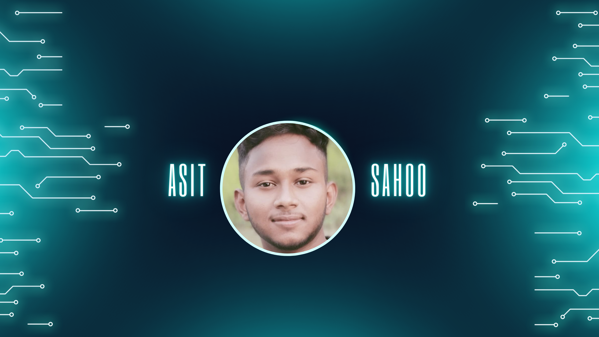

<h1 align="center">Hi 👋, I'm Asit Sahoo</h1>
<h3 align="center">A passionate Software Engineer from India</h3>

I love building software solutions and solving complex problems. Currently, I'm focused on improving my skills in full-stack development and exploring new technologies.

  

- 📫 How to reach me: **[Portfolio](https://asit-sahoo.github.io/asit-portfolio/)**
- 📄 [Resume](https://drive.google.com/file/d/1U7I9lFIqp4L5ES07Xr83wL_rjUo2YOo9/view?usp=sharing)

## Achievements:
- **CodeChef**: 3-star rated
- **LeetCode**: 350+ problems solved
- **GeeksforGeeks**: 450+ problems solved, Rank-25
- **CodingNinja**: 500+ problems solved, Level-Ninja Dominator
- **HackerRank**: 5 stars in C, C++, Java, and Python
- **CODEFORCES**: Contest rating: 1173 (max. newbie, 1173)
  
## Experience:
- **Infosys**: Web Developer Intern at Springboard (8 weeks)
  - Worked on full-stack web development projects.
  - Improved existing web applications and developed new features.
  - Collaborated with a team of developers to ensure smooth project delivery.

## Connect with me:

## Languages and Tools:

  
  
  
  
 
  
  
   
   
   
   
  
  
  

## Featured Projects:
- [BookHolidays](https://mern-booking-app-z2yv.onrender.com/): Created booking full stack website with user authentication, hotel booking, search functionality,
and secure card payments, proficient in cookies management. [Code](https://github.com/Asit-Sahoo/mern-booking-app)
- [Clone of ChatGpt](https://asit-sahoo-mygpt.netlify.app/): Developed a ChatGPT clone with React and Gemini ai API, featuring a user-friendly interface
and natural language processing capabilities, with speech recognition and text to speech functionality. [Code](https://github.com/Asit-Sahoo/MyGpt)

## GitHub Stats:

&nbsp;

