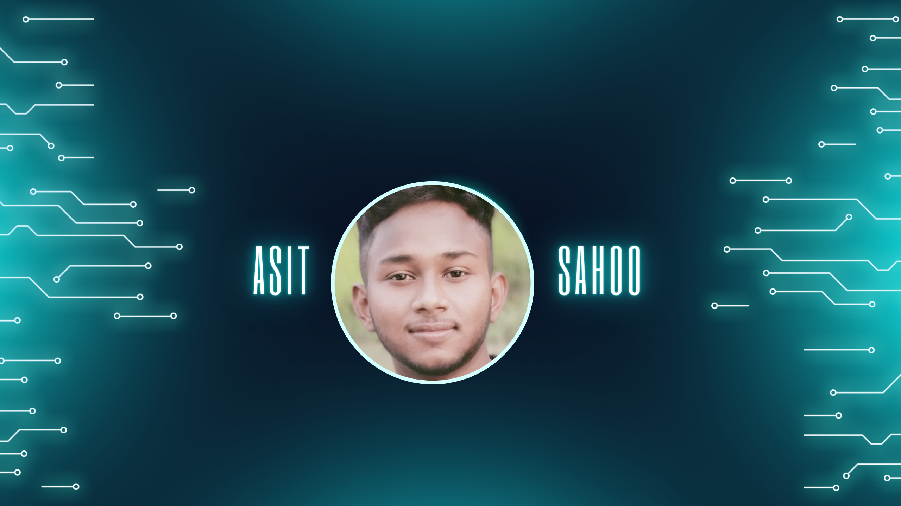

<h1 align="center">Hi 👋, I'm Asit Sahoo</h1>
<h3 align="center">Associate Azure Data Engineer at Fractal</h3>

  A passionate Data Engineer dedicated to building scalable metadata-driven ELT pipelines, optimizing distributed data processing, and delivering analytics-ready datasets. Experienced in working with <b>Microsoft Azure, Azure Databricks, PySpark, and Delta Lake</b> using Medallion Architecture.

 
   

- 💼 Currently working as an **Associate Data Engineer** at **Fractal Analytics**[cite: 1]
- 🎓 **B.Tech in Computer Science & Engineering** from Techno Main Salt Lake (CGPA: 8.60)[cite: 1]
- 📫 How to reach me: **[Portfolio](https://asit-sahoo.github.io/asit-portfolio/)** | **asitsahoo3921@gmail.com**[cite: 1]
- 📄 **[Resume](https://drive.google.com/file/d/1U7I9lFIqp4L5ES07Xr83wL_rjUo2YOo9/view?usp=sharing)**[cite: 1]

---

### 🚀 Experience & Skills Summary

* **Fractal Analytics** — *Associate Data Engineer* (August 2025 – Present)[cite: 1]
  * Designed & developed scalable metadata-driven ELT pipelines using **Azure Data Factory** & **Azure Databricks**[cite: 1].
  * Built reusable **PySpark** transformations via the *Fundamentum Framework*[cite: 1].
  * Implemented **Delta Lake**-based pipelines following the **Bronze-Silver-Gold Medallion Architecture**[cite: 1].
  * Enforced enterprise data governance using **Unity Catalog** and **Azure Key Vault**[cite: 1].
* **Infosys Springboard** — *Full Stack Web Developer & ML Intern* (March 2024 – June 2024)[cite: 1]
  * Worked with Beckn Technology, NLP, Query Tokenization, and Cosine Similarity[cite: 1].

---

### 🛠 Tech Stack & Tools

* **Languages:** Python, SQL, PySpark, C++[cite: 1]
* **Cloud & Big Data:** Microsoft Azure, ADF, Databricks, ADLS Gen2, Apache Spark, Delta Lake, Unity Catalog, Key Vault, Azure DevOps[cite: 1]
* **Data Engineering:** ETL/ELT, Medallion Architecture, Metadata-driven Pipelines, Data Modeling, Data Validation, Incremental Loading, CDC[cite: 1]
* **Databases:** SQL Server, MySQL, MongoDB[cite: 1]
* **Tools & Fundamentals:** Git, GitHub, VS Code, Power BI, Machine Learning, AI Agents, RAG, Data Structures & Algorithms[cite: 1]

---

### 🏆 Achievements & Certifications

- 🎯 **GATE 2025**: Qualified with AIR 10139[cite: 1]
- 📜 **Certifications**: 
  - PySpark Associate (Fractal)[cite: 1]
  - SQL Developer Associate (Fractal)[cite: 1]
  - Anthropic Certified Architect[cite: 1]
- 💻 **Competitive Programming**:
  - **LeetCode**: Rating 1678 (Top 14.76%) | 500+ problems solved[cite: 1]
  - **GeeksforGeeks**: Rank 17 | 500+ problems solved[cite: 1]
  - **CodeChef**: 3-star rated (Max 1632) | Global Rank 369 in Starters 107 Div-3[cite: 1]
  - **HackerRank**: 5 stars in C, C++, Python[cite: 1]
  - **Codeforces**: Max Rating 1184[cite: 1]
  - **Naukri Code360**: Rank 20 in Contest 11[cite: 1]

---

### 📁 Featured Projects

- 🔹 **[Retail Sales Analytics with Medallion Architecture](https://github.com/Asit-Sahoo)**[cite: 1]
  - *Tech:* Azure Data Factory, Databricks, ADLS Gen2, Delta Lake, PySpark, Unity Catalog, Key Vault[cite: 1]
  - Built an end-to-end metadata-driven data pipeline following Bronze-Silver-Gold architecture for KPI generation & analytics[cite: 1].

- 🔹 **[HealthCare Portal](https://github.com/Asit-Sahoo)**[cite: 1]
  - *Tech:* ReactJS, NodeJS, ExpressJS, MongoDB, Flask, Machine Learning, Chatbot[cite: 1]
  - Full-stack platform with role-based authentication, ML-powered symptom checker, and integrated AI chatbot[cite: 1].

- 🔹 **[Book Holidays](https://mern-booking-app-z2yv.onrender.com/)**[cite: 1]
  - *Tech:* ReactJS, Tailwind CSS, ExpressJS, NodeJS, MongoDB[cite: 1]
  - Full-stack hotel booking platform with authentication, search, and secure card payment processing[cite: 1].

---

### 🌐 Connect with me:

  
  
  
  
  
  
  

---

### 📊 GitHub Stats:

